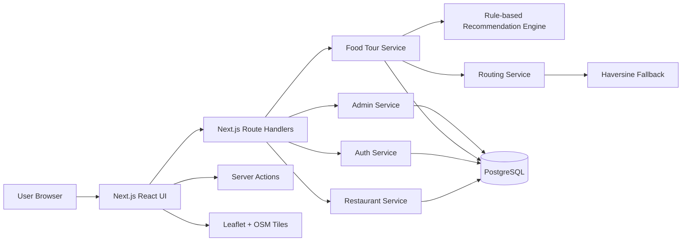
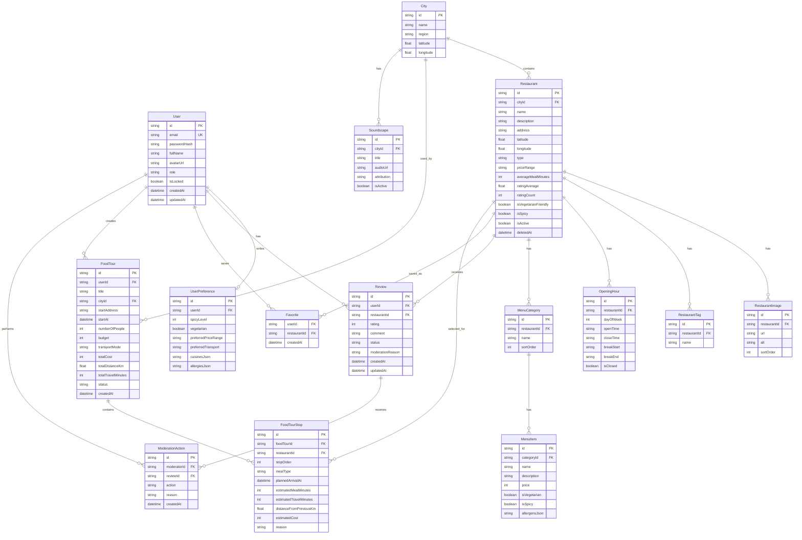

# Food Tour Generator - Phase 1 Architecture and Project Plan

## 1. Context Update

Confirmed constraints:

- Team size: 1 developer who can code full-stack.
- Deadline: 2 days.
- Technology constraints: free choice.
- Deployment: public deployment preferred, local running still required.
- Demo data: prioritize major Vietnamese tourist cities, not only Hoi An and Da Nang.

Because the deadline is very short, the implementation should target a demo-ready MVP with real database, real backend routes, and a polished responsive UI. Features that are expensive but not essential for the core demo should be implemented as simple versions or clearly marked as future features.

## 2. Recommended Platform

Recommended architecture: monolithic full-stack web application.

Stack:

- Frontend: Next.js App Router, React, TypeScript.
- Backend: Next.js Route Handlers and server-side services.
- Database: PostgreSQL.
- ORM: Prisma.
- Authentication: credentials-based login with hashed passwords and role-based access.
- UI: Tailwind CSS, shadcn/ui-style components, lucide-react icons.
- Map: Leaflet with OpenStreetMap tiles.
- Routing: mock routing and Haversine fallback for MVP; optional openrouteservice integration after the MVP is stable.
- Testing: Vitest for algorithm tests; basic Playwright smoke tests if time allows.
- Deployment: Vercel for the app, Supabase or Neon for PostgreSQL.

Reasoning:

- One repository and one runtime are easier for a solo developer in 2 days.
- Next.js still provides a real backend through API route handlers/server actions.
- Prisma keeps schema, migration, seed, and database access clear for presentation.
- Leaflet + OpenStreetMap matches the reference UI without requiring paid map APIs.
- Mock routing avoids being blocked by API keys or external service limits during the demo.

## 3. MVP Scope for 2 Days

### Must Have

- Public landing/login/register pages.
- Demo authentication with roles: User, Moderator, Admin.
- User dashboard matching the reference visual direction.
- Restaurant listing, search, filters, and detail page.
- Leaflet map with restaurant markers and popup.
- Food Tour Generator form.
- Rule-based weighted recommendation engine.
- Generated itinerary timeline with total cost, duration, distance, and explanation.
- Save and view generated tour history.
- Favorite restaurants.
- Basic review and rating.
- Admin dashboard with demo statistics.
- Admin restaurant management with create/edit/hide.
- Seed data for major Vietnamese tourist cities.

### Should Have

- Profile preferences.
- Review moderation status.
- Mobile navigation.
- Loading, empty, and error states for main screens.
- Audio player with placeholder/public-domain sample metadata.

### Defer / Coming Soon

- Real social login.
- Bill splitter backend logic.
- QR payment.
- OCR menu scanner.
- AI/LLM recommendation.
- Offline map.
- PDF export.
- Partner ads and voucher.
- Advanced audit logs.

## 4. Architecture Diagram



## 5. ERD



## 6. Folder Structure

```text
food-tour-generator/
  prisma/
    schema.prisma
    seed.ts
  public/
    images/
    audio/
  src/
    app/
      (public)/
      (user)/
      admin/
      api/
    components/
      layout/
      map/
      restaurant/
      tour/
      admin/
      ui/
    lib/
      auth/
      db/
      validation/
      utils/
    services/
      restaurants/
      reviews/
      tours/
      recommendations/
      routing/
      admin/
    tests/
      unit/
      integration/
  .env.example
  README.md
```

## 7. API Design

Authentication:

- `POST /api/auth/register`
- `POST /api/auth/login`
- `POST /api/auth/logout`
- `GET /api/auth/me`

Restaurants:

- `GET /api/restaurants`
- `GET /api/restaurants/:id`
- `GET /api/restaurants/:id/menu`
- `GET /api/restaurants/:id/reviews`
- `POST /api/restaurants/:id/reviews`
- `PATCH /api/reviews/:id`
- `DELETE /api/reviews/:id`

Favorites:

- `GET /api/favorites`
- `POST /api/favorites`
- `DELETE /api/favorites/:restaurantId`

Food tours:

- `POST /api/food-tours/generate`
- `POST /api/food-tours`
- `GET /api/food-tours`
- `GET /api/food-tours/:id`
- `POST /api/food-tours/:id/clone`
- `DELETE /api/food-tours/:id`

Admin:

- `GET /api/admin/dashboard`
- `GET /api/admin/restaurants`
- `POST /api/admin/restaurants`
- `PATCH /api/admin/restaurants/:id`
- `DELETE /api/admin/restaurants/:id`
- `GET /api/admin/users`
- `PATCH /api/admin/users/:id/role`
- `PATCH /api/admin/users/:id/lock`
- `GET /api/admin/reviews`
- `PATCH /api/admin/reviews/:id/moderate`

## 8. Recommendation Engine

The MVP engine is a rule-based and weighted recommendation engine, not Machine Learning.

Candidate filtering:

1. Remove restaurants that are hidden or soft-deleted.
2. Remove restaurants incompatible with allergies.
3. Remove restaurants closed at the planned time.
4. Remove restaurants whose expected cost exceeds budget.
5. Apply city, distance, price, cuisine, vegetarian, spicy, and meal-type filters.

Scoring:

```text
score =
  preferenceMatch * 30
  + dietaryMatch * 20
  + ratingScore * 15
  + distanceScore * 15
  + budgetScore * 10
  + openingHourScore * 5
  + diversityScore * 5
```

Routing:

- MVP: nearest-neighbor ordering using Haversine distance.
- If route API fails or is not configured: keep itinerary usable and label distance as estimated.
- Later: add openrouteservice matrix/directions integration behind a service interface.

## 9. Seed Data Plan

Target demo data:

- 60 restaurants.
- 220 menu items.
- 100 users.
- 300 reviews.
- 40 generated food tours.
- 12 to 16 cuisine/menu categories.

Priority cities:

- Ha Noi.
- Ho Chi Minh City.
- Da Nang.
- Hoi An.
- Hue.
- Nha Trang.
- Da Lat.
- Can Tho.
- Phu Quoc.
- Sa Pa.

All sample restaurants must be clearly marked as demo/fictitious data in README and seed metadata.

Demo accounts:

- `admin@foodtour.demo`
- `moderator@foodtour.demo`
- `user@foodtour.demo`

Demo passwords must be documented as development-only.

## 10. Two-Day Roadmap

### Day 1 Morning

- Initialize Next.js, TypeScript, Tailwind, Prisma.
- Configure PostgreSQL connection and `.env.example`.
- Create Prisma schema and seed script.
- Build base layout, sidebar, mobile nav, auth pages.

### Day 1 Afternoon

- Implement auth, role checks, demo login.
- Implement restaurant list/detail APIs.
- Implement restaurant listing UI and detail UI.
- Add Leaflet map with seeded markers.

### Day 1 Night

- Implement recommendation engine.
- Add unit tests for Haversine, opening hours, budget, scoring.
- Build generator form and generated itinerary page.

### Day 2 Morning

- Implement save tour, history, favorites.
- Implement basic reviews and rating recalculation.
- Build admin dashboard and restaurant management.

### Day 2 Afternoon

- UI polish against reference image.
- Loading, empty, error states.
- README, seed instructions, demo accounts.
- Basic deployment preparation.

### Day 2 Night

- Deploy if environment and external services cooperate.
- Fix deployment bugs.
- Final demo script and known issues.

## 11. External Dependencies and Policies

- OpenStreetMap tiles require visible attribution, caching behavior, and no bulk download.
- Nominatim public geocoding is limited and should be debounced/cached if used.
- openrouteservice requires an API key and has endpoint limits, so it must remain optional.
- Supabase/Neon free PostgreSQL is suitable for a student demo but has free-tier limits.
- Vercel is suitable for public demo deployment of the Next.js app.

## 12. Definition of Done for MVP

- App runs locally from README instructions.
- Database migrates and seeds reproducibly.
- Demo accounts can log in.
- User can browse restaurants and see map markers.
- User can generate a food tour and see timeline/map/summary.
- User can save and revisit a tour.
- User can favorite and review restaurants.
- Admin can view dashboard and manage restaurants/reviews/users at a basic level.
- Core recommendation utility tests pass.
- No secrets committed.
- README clearly states demo data is fictitious.

## 13. Risks

- Full original scope is too large for 2 days.
- Public deployment can be delayed by database/provider limits.
- Real geocoding/routing APIs may hit rate limits or need keys.
- Review image upload and audio assets can consume too much time.
- Admin module must be kept minimal to protect the core user demo.

## 14. Suggested Commit Plan

- `docs: add architecture and MVP roadmap`
- `chore: initialize nextjs prisma project`
- `feat: add database schema and seed data`
- `feat: add authentication and role guards`
- `feat: add restaurant browsing and map`
- `feat: implement food tour recommendation engine`
- `feat: add tour history favorites and reviews`
- `feat: add admin dashboard and management`
- `test: add recommendation engine tests`
- `docs: add setup deployment and demo guide`
